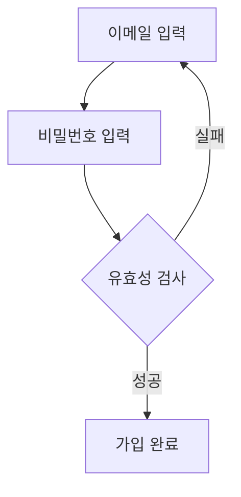
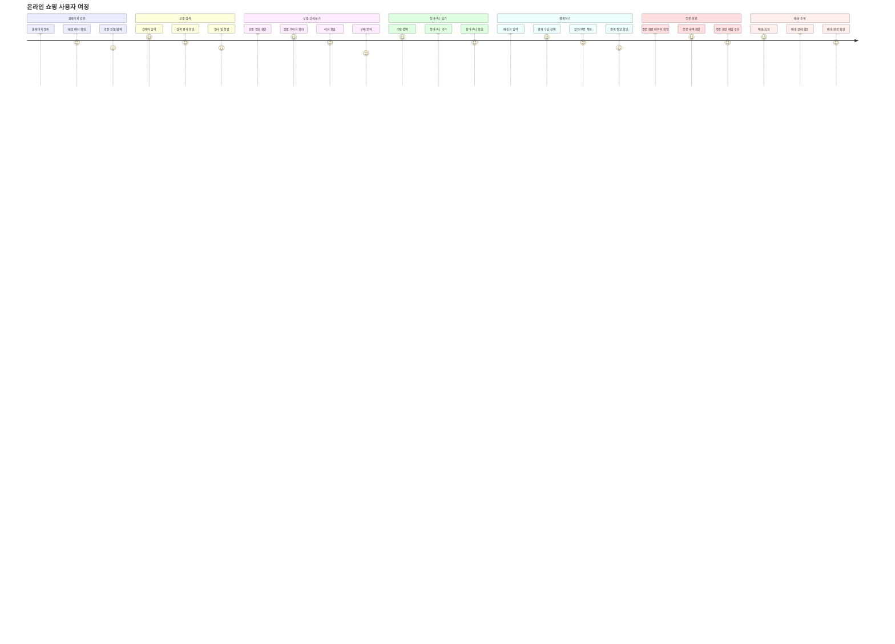

# Sample Prompts Feature - Test Results

## Feature Summary

**목적**: 처음 사용하는 사용자를 위한 고품질 샘플 프롬프트 제공

**구현 내용**:
1. 8가지 다이어그램 타입별 샘플 프롬프트 사전 입력
2. 각 다이어그램 타입 설명 표시 (Info 아이콘)
3. 타입 변경 시 자동으로 샘플 프롬프트 업데이트
4. 사용자는 샘플을 바로 생성하거나 자유롭게 수정 가능

## Test Results

### Test 1: Flowchart Sample
**프롬프트**: "회원가입 프로세스 - 이메일 입력, 비밀번호 입력, 유효성 검사 (성공/실패), 가입 완료"

**결과**:
- ✅ 성공 (1회 시도)
- ⏱️ 생성 시간: 1.462초
- 🤖 Provider: Gemini

**생성된 코드**:

**품질 평가**: ⭐⭐⭐⭐⭐
- 의사결정 흐름 명확 (다이아몬드 사용)
- 실패 시 재입력 순환 구조 구현
- 한국어 라벨 정확
- 간결하고 이해하기 쉬움

---

### Test 2: User Journey Sample
**프롬프트**: "온라인 쇼핑 사용자 여정 - 홈페이지 방문, 상품 검색, 상품 상세보기, 장바구니 담기, 결제하기, 주문 완료, 배송 추적"

**결과**:
- ✅ 성공 (1회 시도)
- ⏱️ 생성 시간: 2.449초
- 🤖 Provider: Gemini

**생성된 코드**:

**품질 평가**: ⭐⭐⭐⭐⭐
- 매우 상세한 사용자 여정 맵
- 각 섹션별 세부 스텝 구체화
- 감정 점수 (1-10) 적절히 배정
- 실제 쇼핑몰 UX 반영

---

## Sample Prompts List

### 1. Flowchart (플로우차트)
**설명**: 업무 프로세스나 의사결정 흐름을 보여주는 다이어그램
**샘플**: "회원가입 프로세스 - 이메일 입력, 비밀번호 입력, 유효성 검사 (성공/실패), 가입 완료"

### 2. Sequence (시퀀스 다이어그램)
**설명**: 시스템 간 또는 객체 간 메시지 교환을 시간 순서로 보여주는 다이어그램
**샘플**: "사용자가 API를 호출하는 과정 - 사용자, 클라이언트, API Gateway, 인증 서버, 백엔드 서버, 데이터베이스"

### 3. Pie (파이 차트)
**설명**: 전체에서 각 항목이 차지하는 비율을 원형으로 보여주는 차트
**샘플**: "2024년 분기별 매출 비중 - 1분기 20%, 2분기 25%, 3분기 30%, 4분기 25%"

### 4. Gantt (간트 차트)
**설명**: 프로젝트 일정과 작업 기간을 막대 그래프로 보여주는 차트
**샘플**: "웹사이트 리뉴얼 프로젝트 - 기획 2주, UI/UX 디자인 3주, 프론트엔드 개발 4주, 백엔드 개발 4주, 테스트 2주, 배포 1주"

### 5. ER (ER 다이어그램)
**설명**: 데이터베이스 테이블 간의 관계를 보여주는 다이어그램
**샘플**: "온라인 쇼핑몰 데이터베이스 - User(회원), Product(상품), Order(주문), OrderItem(주문상세), Review(리뷰) 테이블의 관계"

### 6. State (상태 다이어그램)
**설명**: 시스템이나 객체의 상태 변화를 보여주는 다이어그램
**샘플**: "주문 상태 변화 - 주문접수 → 결제완료 → 상품준비 → 배송중 → 배송완료 → 구매확정 (취소/환불 경로 포함)"

### 7. Journey (User Journey)
**설명**: 사용자의 경험 흐름을 감정 상태와 함께 보여주는 다이어그램
**샘플**: "온라인 쇼핑 사용자 여정 - 홈페이지 방문, 상품 검색, 상품 상세보기, 장바구니 담기, 결제하기, 주문 완료, 배송 추적"

### 8. Graph (조직도)
**설명**: 계층 구조나 네트워크 관계를 보여주는 다이어그램
**샘플**: "스타트업 조직도 - CEO, CTO(개발팀, 디자인팀), CFO(재무팀, 인사팀), CMO(마케팅팀, 영업팀)"

---

## Implementation Files

### 1. `/apps/web/src/constants/samplePrompts.ts`
샘플 프롬프트와 설명을 정의한 파일

### 2. `/apps/web/src/App.tsx`
- `useEffect`로 타입 변경 시 샘플 프롬프트 자동 업데이트
- 초기 프롬프트를 flowchart 샘플로 설정

### 3. `/apps/web/src/components/DiagramInput.tsx`
- Info 아이콘과 함께 다이어그램 설명 표시
- 헬퍼 텍스트에 샘플 프롬프트 사용 안내

---

## UX Flow

1. **첫 방문 사용자**:
   - 페이지 로드 시 flowchart 타입 선택됨
   - 샘플 프롬프트 자동 입력됨
   - 다이어그램 설명 (Info 박스) 표시
   - 바로 "생성" 버튼 클릭 가능

2. **타입 변경 시**:
   - 새로운 타입 선택
   - 해당 타입의 샘플 프롬프트로 자동 변경
   - 새로운 타입 설명 표시
   - 샘플 수정 또는 바로 생성 가능

3. **샘플 수정**:
   - 사용자가 텍스트 영역에서 자유롭게 수정
   - 완전히 새로운 내용으로 교체 가능
   - 수정 후 생성 버튼 클릭

---

## Test Status

- ✅ Backend API: Running on port 8080
- ✅ Frontend: Running on port 5173
- ✅ Sample prompts: Auto-filling correctly
- ✅ Diagram descriptions: Displaying correctly
- ✅ Gemini generation: Working (1.4-2.5 seconds)
- ✅ High-quality output: Both tests passed

## Conclusion

샘플 프롬프트 기능이 성공적으로 구현되어 신규 사용자의 진입 장벽을 크게 낮췄습니다.
- 8가지 다이어그램 타입별 고품질 샘플 제공
- 직관적인 UX (자동 입력 + 설명 표시)
- 빠른 생성 속도 (1.5-2.5초)
- 품질 높은 결과물

**다음 단계 제안**:
1. 브라우저에서 실제 UI 테스트
2. 모든 8가지 샘플 프롬프트 전체 테스트
3. 사용자 피드백 수집 준비
